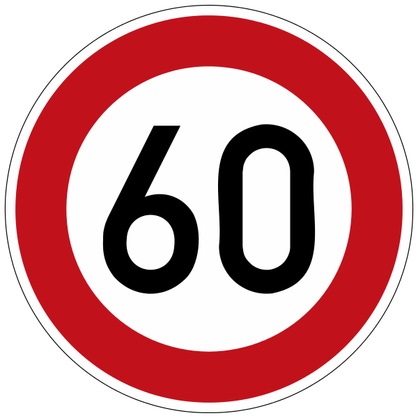
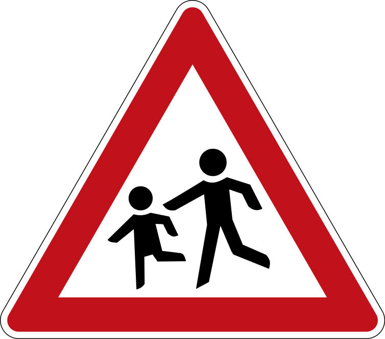
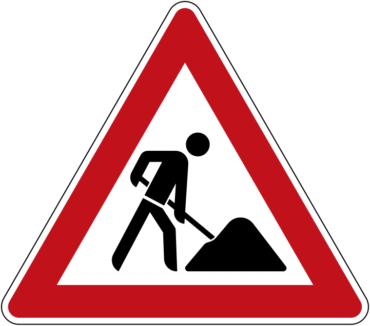
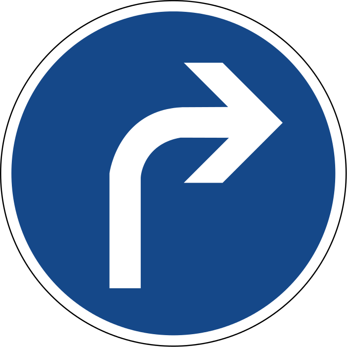
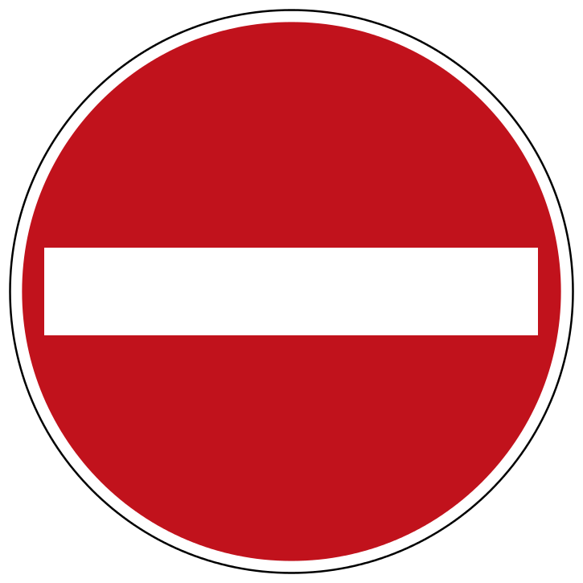

#**Traffic Sign Recognition Writeup** 

---

**Build a Traffic Sign Recognition Project**

The goals / steps of this project are the following:
* Load the data set (see below for links to the project data set)
* Explore, summarize and visualize the data set
* Design, train and test a model architecture
* Use the model to make predictions on new images
* Analyze the softmax probabilities of the new images
* Summarize the results with a written report

[//]: # (Image References)

[image1]: ./distribution_of_train.png "Distribution"
[image3]: ./grayscale.png "Grayscaling"
[image2]: ./train_image.png "Random Noise"
[image4]: ./probabilities.png "Probabilities"

## Rubric Points
###Here I will consider the [rubric points](https://review.udacity.com/#!/rubrics/481/view) individually and describe how I addressed each point in my implementation.  

---
<!--
###Writeup / README

####1. Provide a Writeup / README that includes all the rubric points and how you addressed each one. You can submit your writeup as markdown or pdf. You can use this template as a guide for writing the report. The submission includes the project code.

You're reading it! and here is a link to my [project code](https://github.com/sf624/CarND-Traffic-Sign-Classifier-Project/blob/master/Traffic_Sign_Classifier.ipynb)
-->

Here is a link to my [project code](https://github.com/sf624/CarND-Traffic-Sign-Classifier-Project/blob/master/Traffic_Sign_Classifier.ipynb)

###Data Set Summary & Exploration

####1. Provide a basic summary of the data set and identify where in your code the summary was done. In the code, the analysis should be done using python, numpy and/or pandas methods rather than hardcoding results manually.

The code for this step is contained in the second code cell of the IPython notebook.  

I used the numpy library to calculate summary statistics of the traffic
signs data set:

* The size of training set is 34799
* The size of test set is 12630
* The shape of a traffic sign image is (32, 32, 3)
* The number of unique classes/labels in the data set is 43

####2. Include an exploratory visualization of the dataset and identify where the code is in your code file.

The code for this step is contained in the 2nd code cell of the IPython notebook.  

Here is an exploratory visualization of the data set. It is a bar chart showing how the traning data is ditributed along the Class ID. From the figure, it seems it is not uniformly distributed.

![alt text][image1]

###Design and Test a Model Architecture

####1. Describe how, and identify where in your code, you preprocessed the image data. What tecniques were chosen and why did you choose these techniques? Consider including images showing the output of each preprocessing technique. Pre-processing refers to techniques such as converting to grayscale, normalization, etc.

The code for this step is contained in the fourth code cell of the IPython notebook.

As a first step, I decided to convert the images to grayscale to make data compatible with LeNet-5.

Here is an example of a traffic sign image before and after grayscaling.

![alt text][image2] ![alt text][image3]

As a second step, I normalized the image data to eliminate the effect of light intensity.

####2. Describe how, and identify where in your code, you set up training, validation and testing data. How much data was in each set? Explain what techniques were used to split the data into these sets. (OPTIONAL: As described in the "Stand Out Suggestions" part of the rubric, if you generated additional data for training, describe why you decided to generate additional data, how you generated the data, identify where in your code, and provide example images of the additional data)

Traing, Validation and testing data were already splited in the original [dataset](https://d17h27t6h515a5.cloudfront.net/topher/2017/February/5898cd6f_traffic-signs-data/traffic-signs-data.zip). So I just used as they were. No any modification was done. In this section.

####3. Describe, and identify where in your code, what your final model architecture looks like including model type, layers, layer sizes, connectivity, etc.) Consider including a diagram and/or table describing the final model.

The code for my final model is located in the fifth cell of the ipython notebook. 

My final model consisted of the following layers:
It is almost similar to original LeNet-5 except a dropout after flatteing the 2nd convolution layer.

| Layer         		|     Description	        					| 
|:---------------------:|:---------------------------------------------:| 
| Input         		| 32x32x1 grayscale image   							| 
| Convolution 5x5     	| 1x1 stride, valid padding, outputs 28x28x6 	|
| RELU					|												|
| Max pooling	      	| 2x2 stride,  outputs 14x14x6 				|
| Convolution 5x5	    | 1x1 stride, valid padding, outputs 10x10x16      									|
| RELU					|												|
| Max pooling | 2x2 stride,  outputs 5x5x16 |
| Flatten		| output 400        									|
| **Dropout** | Keep probability: 0.5 |
| Fully connected		| output 120        									|
| RELU					|												|
| Fully connected		| output 84        									|
| RELU					|												|
| Fully connected		| output 43        									|
| Softmax				|        									|
 

####4. Describe how, and identify where in your code, you trained your model. The discussion can include the type of optimizer, the batch size, number of epochs and any hyperparameters such as learning rate.

The code for training the model is located in the sixth cell of the ipython notebook. 

To train the model, I used an AdamOptimizer to minimize cross entropy of softmax probabilites with one hot encoded class ids. Batchsize, epochs and learning rate were each set to 128, 10 and 0.001.

####5. Describe the approach taken for finding a solution. Include in the discussion the results on the training, validation and test sets and where in the code these were calculated. Your approach may have been an iterative process, in which case, outline the steps you took to get to the final solution and why you chose those steps. Perhaps your solution involved an already well known implementation or architecture. In this case, discuss why you think the architecture is suitable for the current problem.

The code for calculating the accuracy of the model is located in the sixth cell of the Ipython notebook.

My final model results were:
* training set accuracy of 0.993
* validation set accuracy of 0.949
* test set accuracy of 0.931

Although there were more sophisticated architectures proposed to tackle this problem, I simply started by using LeNet-5 for its computational efficiency and seeked its potentials to gain higher performance. According to the paper of P. Sermanet and Y. LeCun, it seemed that grayscale image is still capable of achieving 93% accuracy, so I just simply converted the colored images to grayscale. And also applied normalization to eliminate the effect of light initensity which has no meanings on traffic signs.

The original LeNet-5 have shown high accuracy in training set but comparatively low accuracy (below 90%) in validation set. So I thought that certain generalization technique will help its performance imporvement. As a solution, I added dropout layer between fully connected layer (400 -> 120), because those layers had large number of weight and bias parameters to tune, which might have tend to fall in over fitting problem if not for dropout.

###Test a Model on New Images

####1. Choose five German traffic signs found on the web and provide them in the report. For each image, discuss what quality or qualities might be difficult to classify.

Here are five German traffic signs that I found on the web (extracted from Wikipedia):

| Image			        |     Meaning	        					| 
|:---------------------:|:---------------------------------------------:| 
| | 1. Speed limit 60km/h |
| | 2. Children crossing |
| | 3. Roadworks |
| | 4. Turn right ahead |
| | 5. No entry |

2nd and 3rd images might be difficult to distinguish, because both have similar property of red triangle.

####2. Discuss the model's predictions on these new traffic signs and compare the results to predicting on the test set. Identify where in your code predictions were made. At a minimum, discuss what the predictions were, the accuracy on these new predictions, and compare the accuracy to the accuracy on the test set (OPTIONAL: Discuss the results in more detail as described in the "Stand Out Suggestions" part of the rubric).

The code for making predictions on my final model is located in the tenth cell of the Ipython notebook.

Here are the results of the prediction:

| Input			        |     Prediction	        					| 
|:---------------------:|:---------------------------------------------:| 
| Speed limit 60km/h      		| Speed limit 60km/h   									| 
| Children crossing     			| Children crossing 										|
| Road works					| Road works											|
| Turn right ahead	      		| Turn right ahead					 				|
| No entry			| No entry      							|

The model was able to correctly guess 5 of the 5 traffic signs, which gives an accuracy of 100%. Comparing with the former test accuracy of 93.1%, it seems to perform better on the new image. But as decribed in the following sentence, the softmax probability of 2nd image was 29% which is relatively lower than the other 4 images (above 90%), so there seems to had a chance to fell to accuracy of 80% (or even lower) on the new images if the training process leaded to worser result. (Because this optimization process is "stochastic", there was a chance to get lower score.) Also if I have to really calculate precise accuracy, I would have to process much more number of images, not only five.

####3. Describe how certain the model is when predicting on each of the five new images by looking at the softmax probabilities for each prediction and identify where in your code softmax probabilities were outputted. Provide the top 5 softmax probabilities for each image along with the sign type of each probability. (OPTIONAL: as described in the "Stand Out Suggestions" part of the rubric, visualizations can also be provided such as bar charts)

The code for making predictions on my final model is located in the 11th cell of the Ipython notebook.

Except for the 2nd image, the model is highly sure for each signs ( probability of 0.94 ~ 0.99 ). But for the 2nd image, it is not much certain. This could be because the small children image in the triangular sign was highly corrupted when resizing the image into 32x32 pixels.

| Probability (round down)         	|     Prediction	        					| 
|:---------------------:|:---------------------------------------------:| 
| 0.94         			| Speed limit 60km/h   									| 
| 0.29     				| Children crossing 										|
| 0.99					| Road works											|
| 0.99	      			| Turn right ahead					 				|
| 0.99				    | No entry      							|

![alt text][image4]
